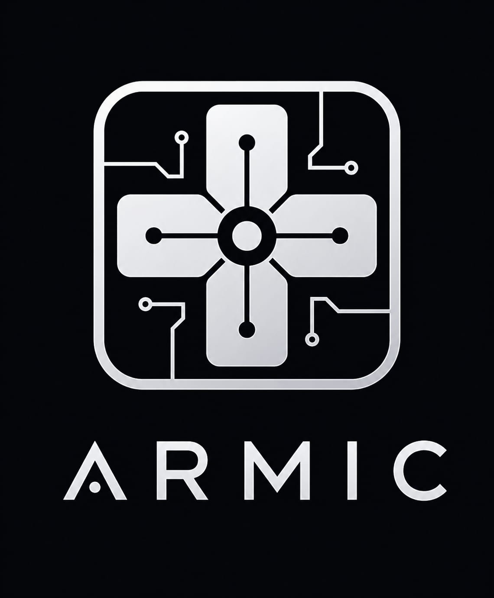
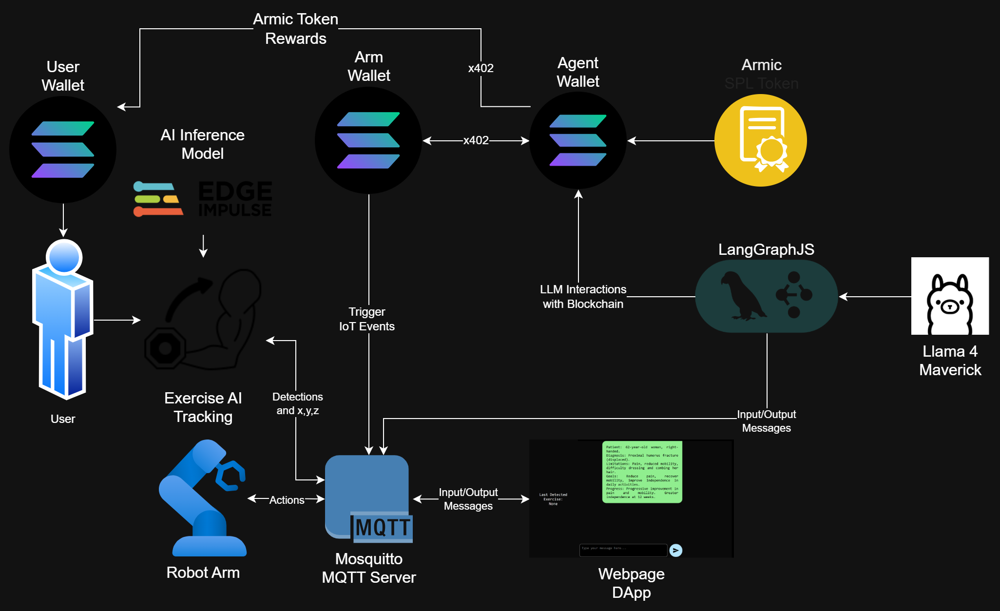
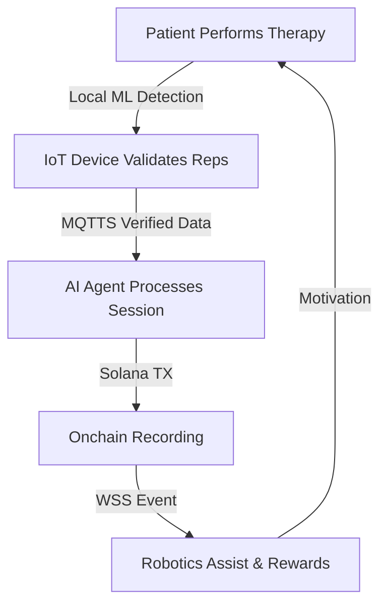
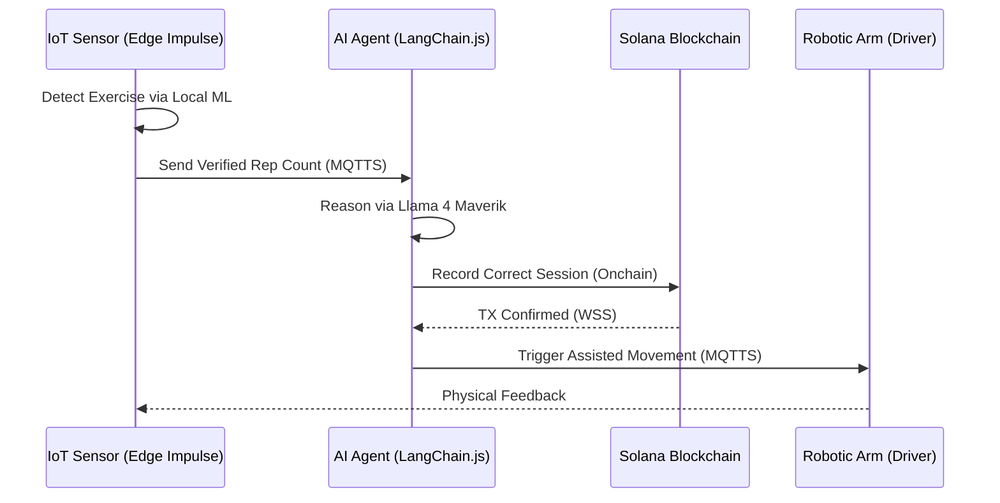

# Armic: Autonomous Rehabilitation via Solana-Powered AI Agents

https://kickstart.easya.io/token/DcTVUogWykX1JeBmTq48Fzj2Lc3Y7zwHQS1CyZ9SHnXf

> **ARMIC turns rehabilitation into an autonomous, measurable, and incentivized system powered by AI agents.**

---

## 🛑 Rehabilitation is Broken
Rehabilitation today is **manual, inconsistent, and difficult to track**. 
- **Patients drop out** before completing therapy.
- **Progress is rarely measurable.**
- **Outcomes are not trusted** by providers or insurers.

This creates a system where recovery is slow, inefficient, and often unsuccessful.

---

## ⚡ Introducing ARMIC
ARMIC transforms rehabilitation into an autonomous system powered by AI agents. Each patient is assigned an AI agent that **tracks** recovery, **adjusts** therapy dynamically, and **executes** actions automatically.

### The ARMIC Loop

---

## 🛠 Technical Stack (v2.0 Upgrade)

### Hardware & Edge AI
- **ESP32 (2x)**: Main IoT controllers. The sensor unit runs **Edge Impulse AI** locally to detect and verify exercises.
- **ADXL335**: Triple-axis accelerometer for precision motion tracking.
- **Robotic Arm**: Mechanical assist unit.
- **8 Channel Relay**: For DC motor control.

### Software & Infrastructure
- **Blockchain**: [Solana](https://solana.com/) (Mainnet) - High-throughput engine for recording every correct session.
- **AI Model**: **Llama 4 Maverik** - State-of-the-art inference for clinical reasoning.
- **Framework**: [LangChain.js](https://js.langchain.com/) - Orchestrating agents and tool calls in a modern JS environment.
- **Communication**: 
  - **MQTTS (IoT)**: Secure encrypted communication for sensor data.
  - **WSS (Web & Agents)**: Real-time WebSockets for agent-to-platform syncing.

---

## 🧠 System Architecture

---

## 💎 The $ARMIC Economy
ARMIC introduces a tokenized incentive system. Patients earn **$ARMIC** by completing therapy sessions.
- **Transparency**: Every correct session is recorded on the Solana ledger.
- **Autonomy**: AI agents automatically distribute rewards based on verified performance.
- **Alignment**: Incentivizes engagement for patients and efficiency for providers.

### Token Contract (Solana)
*Mainnet Address:* `Coming Soon...`

---

## 🚀 Launching Soon
**Launching on EasyA Kickstart Thursday 30th, 2026 at 3:00 PM**

- [**X (Twitter)**](https://x.com/projectarmic)
- [**GitHub Repository**](https://github.com/altaga/Armic)

---

## 👥 About Us
Biomedical engineers building at the intersection of robotics, AI, and blockchain.
- [Victor Alonso Altamirano](https://www.linkedin.com/in/victor-alonso-altamirano-izquierdo-311437137/)
- [Alejandro Sanchez Gutierrez](https://www.linkedin.com/in/alejandro-sanchez-gutierrez-11105a157/)
- [Luis Eduardo Arevalo Oliver](https://www.linkedin.com/in/luis-eduardo-arevalo-oliver-989703122/)

---
*ARMIC is the first step toward programmable, intelligent rehabilitation.*
